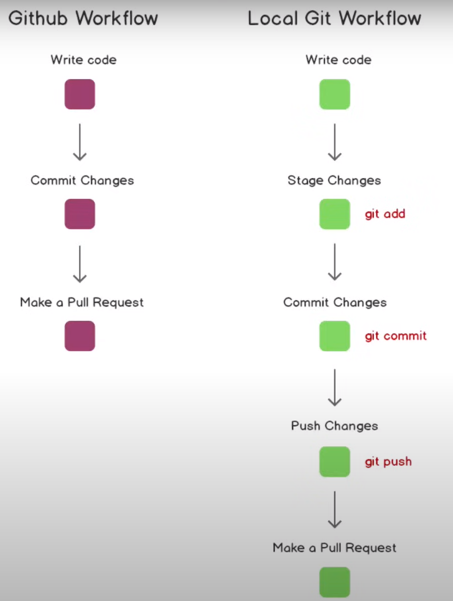

# Github Tutorial
link: [Git and Github for Begineer](https://www.youtube.com/watch?v=RGOj5yH7evk&t=1727s)

## What is Git?
Free and open source ==version control== system.

## What is Version Control?
The management of changes to documents, computer programs, large websites, and other collections of information.

# Term
**Directory** &rarr; <code>Folder</code>

**Terminal or Command Line** &rarr; <code>Interface for Text Commands</code>

**CLI** &rarr; <code>Command Line Interface</code>

**cd** &rarr; <code>Change directory</code>

**Code Editor** &rarr; <code>Word Processor for Writting Code</code>

**Repository** &rarr; <code>Project, or the folder/place where your projecct is kept</code>

**Github** &rarr; <code>A website to host your repositories online</code>


## Git Commands
* ```git clone```    &rarr; Bring a repository that is hosted somewhere like Github into a folder on your local machine
* ```git add```    &rarr;  Track your files and changes in Git
* ```git commit```    &rarr; Save your files in Git
* ```git push```    &rarr; Upload Git commits to a remote repo, like Github
* ```git pull```    &rarr; Download changes from remote repo to your local machine, the opposite of push
* ```ls -la```    &rarr; Check list of files

## Set up
- မိမိ computer ထဲတွင် git သွင်းထားရမည်။
- Visual Studio Code သည် github နှင့်တွဲဖက်သုံး၍ရသည်။
- VSC တွင် folder တစ်ခုတည်ဆောက်ပြီး “git clone [link]” လုပ်ပါ။
- ထိုအခါ remote github repository သည် local သို့ hidden file များအပါအဝင်ရောက်လာမည်ဖြစ်သည်။
- Hidden file များကိုကြည့်လိုပါက “la” or “ls -a” or “ls -la” ဖြင့်ကြည့်နိုင်သည်။
- “git status” command ဖြင့် လက်ရှိ file တွေရဲ့ status ကိုကြည့်နိုင်သည်။
- local မှာ file တစ် file ချင်းဆိ add ချင်ပါက “git add [file name]” ကိုသုံးပြီး file အားလုံးကို add ချင်ပါက “git add .” ကိုသုံးသည်။
- “git commit -m “message” -m “description”” command ဖြင့် local မှာ save မည်။

## SSH Keys
- github account owner ဖြစ်ကြောင်းသက်သေပြဖို့ရန်အတွက် key ထုတ်ပြီးသိမ်းထားရပါမည်။
- ```ssh-keygen -t rsa -b 4096 -C “htetaunglynn94@gmail.com”``` ဖြင့် key generate လုပ်ပါ။
- ```ls | grep keygen``` ဖြင့် key ကိုပြန်ရှာလို့ရပါသည်။
- key ၂ ခု ထွက်လာပါမည်။ ယခုပြုလုပ်ချက်တွင် “keygen” နှင့် “keygen.pub” ဆိုပြီးနှစ်ခုထွက်လာပါသည်။
- “keygen.pub” public file ကို github တွင်တင်ပေးထားရမည်။
- ```cat keygen.pub``` ဖြင့် ဖွင့်ကြည့်နိုင်သည်။ ကျန်တစ်ခုကို local တွင်သိမ်းထားရမည်။
- ၎င်း key အား copy လုပ်ပြီး github က SSH and GPG keys ထဲမှာသွား add ပေးရမည်။
- ````eval "$(ssh-agent -s)"```` command ဖြင့် agent pid ရယူပါ။
- ```ssh-add ~/.ssh/keygen``` command ဖြင့် key ကို add ပေးပါ။

## Git push
- ```git push origin main``` ဖြင့် upload လုပ်နိုင်သည်။
- ```git push -u origin main``` လုပ်ထားခြင်းဖြင့် ခနခန branch ကိုရွေးချယ်စရာမလိုတော့ပဲ ```git push``` ဖြင့်သာလုပ်နိုင်ပါသည်။ (-u means --set-upstream)



## Git init
- ```git init``` command ဖြင့် repo တစ်ခုကို add ပေးခြင်းဖြစ်သည်။

## Git remote
- Local ထဲမှာ file တစ်ခု create လုပ်ပြီးရင် remote ကမသိသေးတဲ့အတွက် link add ပေးရပါမယ်။
- ```git remote add origin <link>``` command ကိုသုံးပါတယ်။

## Change branch from master to main
- ```git branch -m master main``` master မှ main သို့ပြန်ပြောင်းရာတွင်အသုံးပြုသည်။

## Git Branching
- ```git branch``` to check number of branches and * means current branch
- ```git checkout -b feature-readme-instruction``` create a new branch
- ```git checkout main``` change main branch
- ```git diff feature-readme-instructions``` compare two versions of code to check what is difference
- ```git branch -d feature-readme-instructions``` to delete unnecessary branch
- ``````


